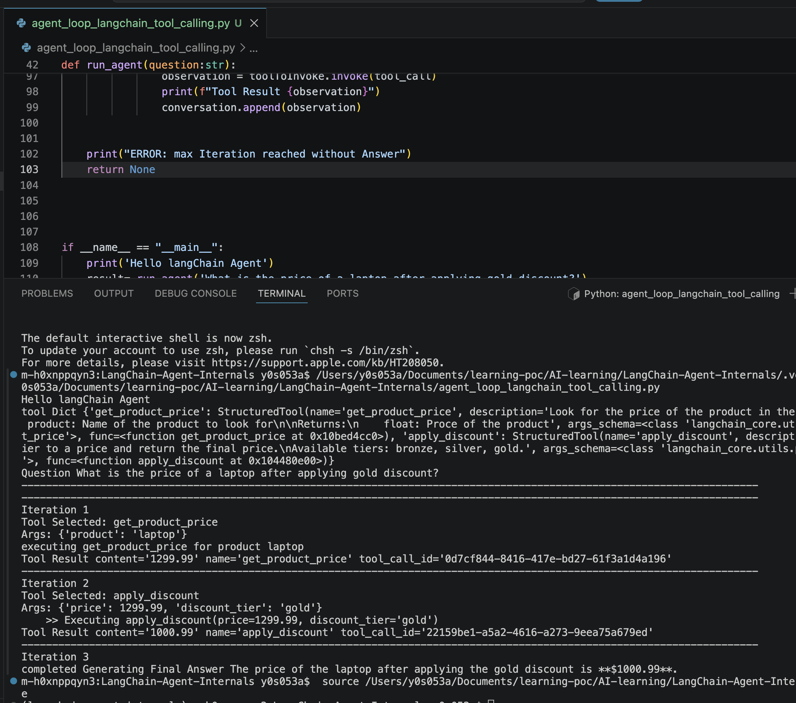
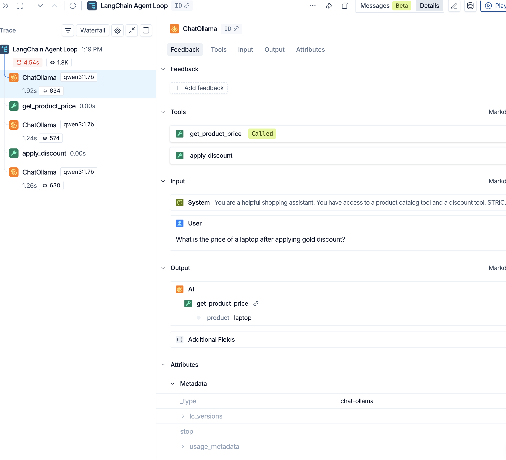
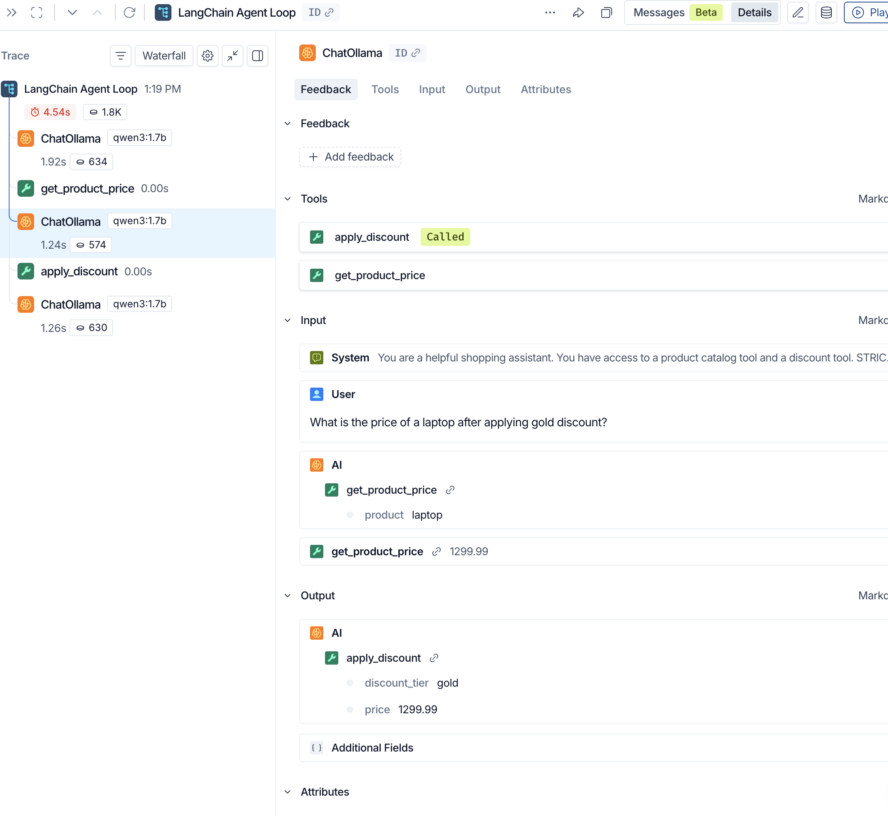
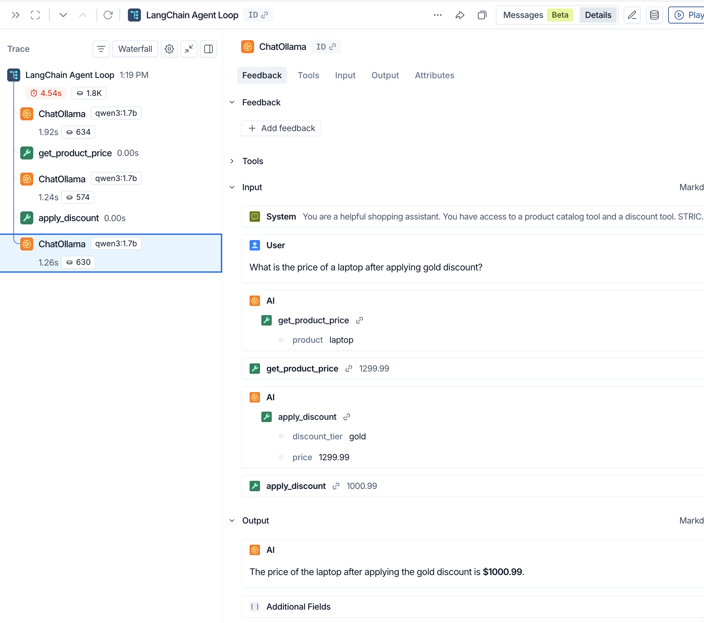
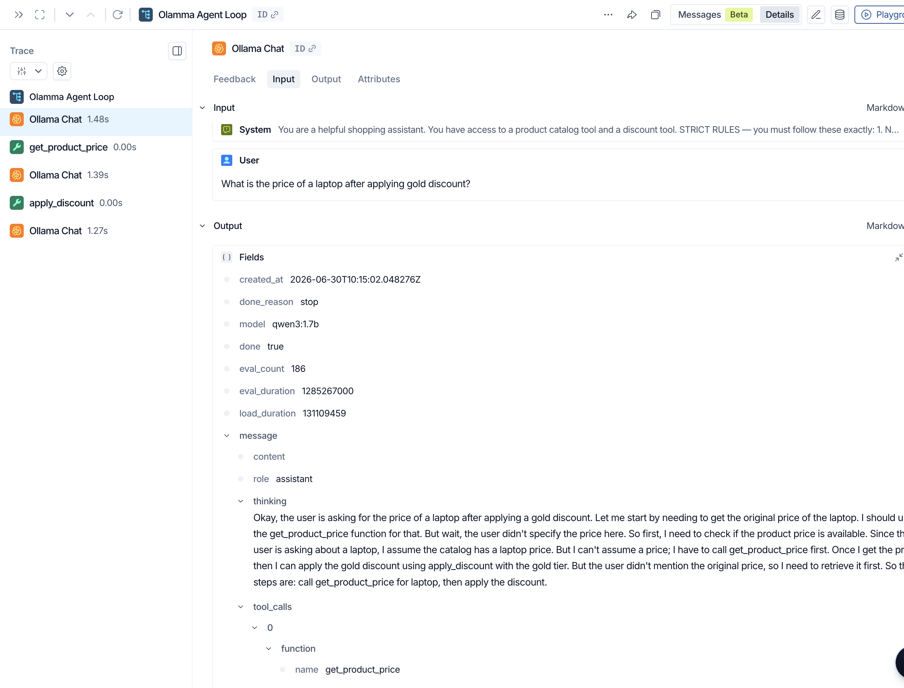
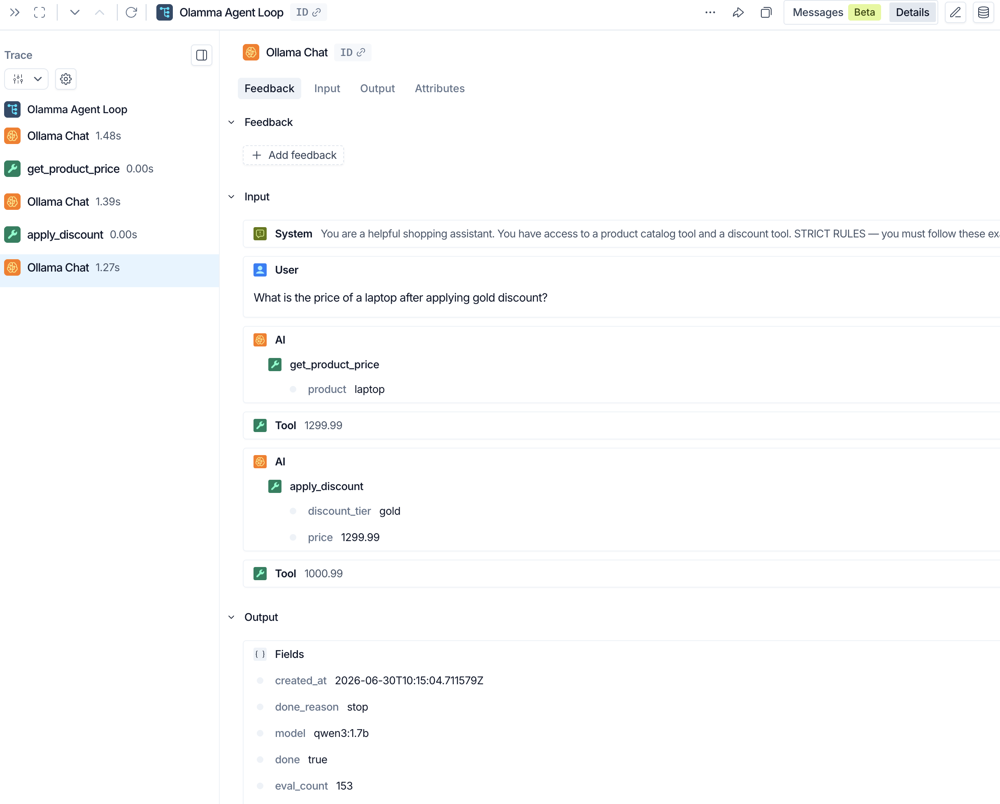
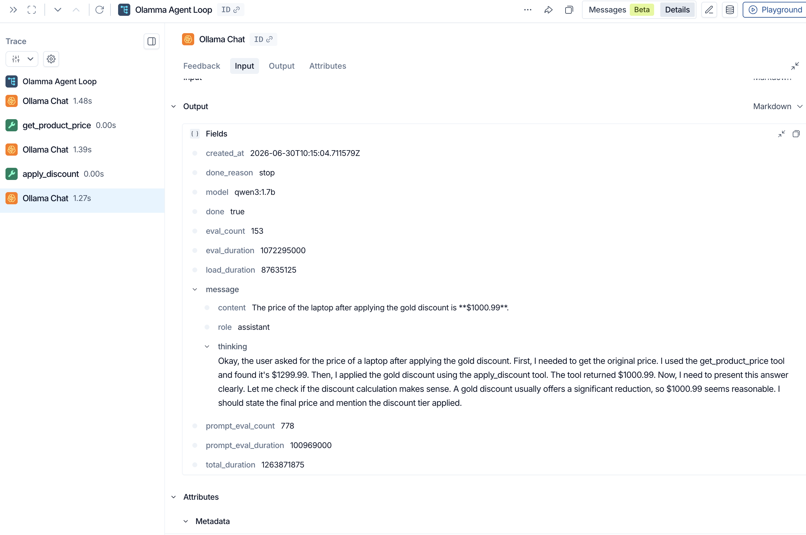

### Implementing ReAct Agent using low level LancChain Objects 
[agent_loop_langchain_tool_calling.py]

Result:

Execution of Agent Iterations

LangSimth Screenshots

### Implementing ReAct Agent using low level Ollama SDK objects without the use of langChain Objects
[agent_loop_raw_function_calling.py]

LangSimth Screenshots

### Implementing ReAct Agent using only ReAct Prompt Engineering [no tools]
[agent_loop_raw_function_calling.py]

LangSmith trace- https://smith.langchain.com/public/1b0f6df6-e6d0-4cae-be6f-789261495c42/r/019f192d-9e79-7fe1-acf3-be4e28641abb

